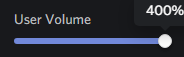
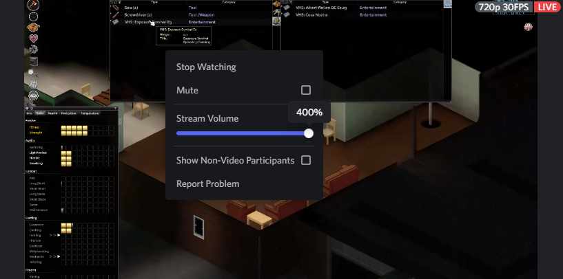

# Custom Volume Range

Allows you to set the volume of users and screenshares over 200%

For streams, **right-click the screenshare** and adjust the volume slider there. For now, **volume bar in the bottom right corner can't adjust over 200%.**

